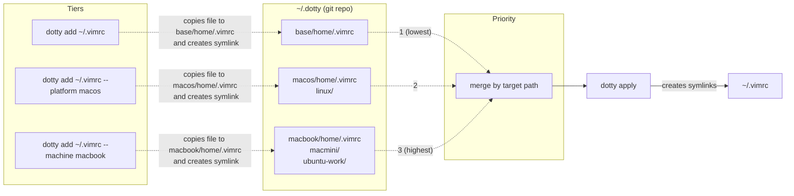
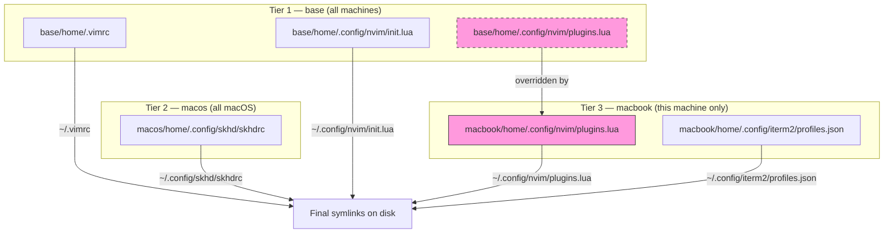
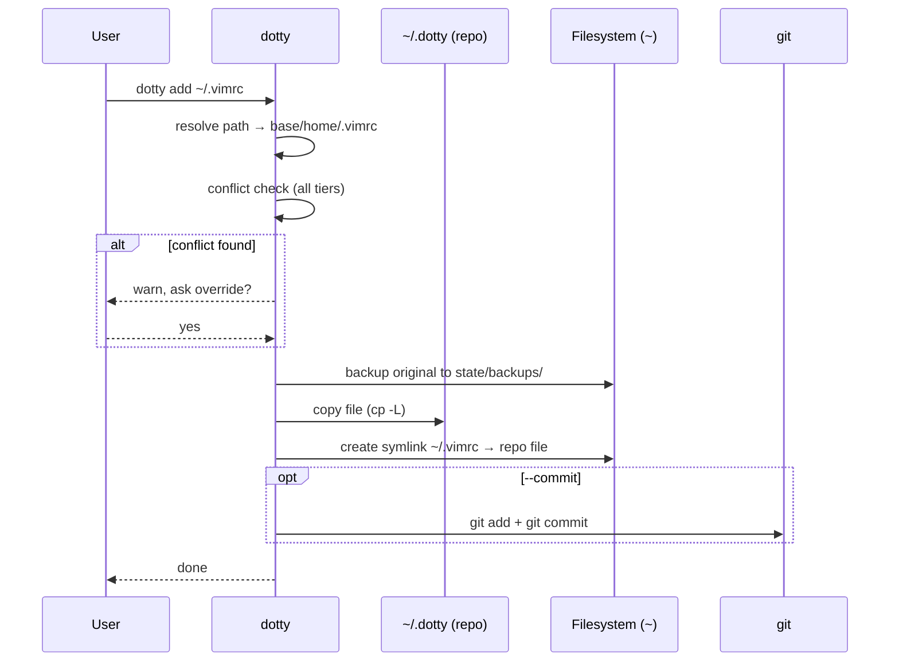
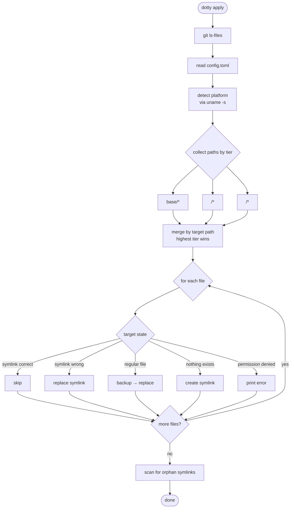

# dotty (MVP)

## Concept

A minimal dotfiles manager for multiple machines. Config files live in a git repository organized by priority tiers — `base/`, `<platform>/`, `<machine>/` — and are linked to their real locations via file-level symlinks.

**How it works:** `dotty add ~/.vimrc` copies the file into the repo and creates a symlink in its place. `dotty apply` resolves all tiers, merges them by priority (machine overrides platform overrides base), and creates symlinks. Higher-priority files simply replace lower-priority symlinks for the same target path.

**Philosophy:** convention over configuration. No config files, no templates, no hooks. The repo structure tells dotty what to do. Encryption is handled by git-crypt, not dotty.

**Audience:** built for a user across multiple machines.

### Overview



---

## Paths

**Repository:** `$DOTTY_HOME` if set, otherwise `~/.dotty`.

**State directory:** `$DOTTY_STATE_HOME` if set, otherwise `$XDG_STATE_HOME/dotty` (default `~/.local/state/dotty`).
Stores runtime data that doesn't belong in the repo:

```
~/.local/state/dotty
├── config.toml      # machine name + managed files map (repo_path → target)
└── backups/         # backup copies of replaced files
```

Created lazily by each command that needs it. No command assumes it exists upfront.

All commands (`init`, `config`, `add`, `remove`, `apply`, `status`, `clean`) use the repo path.

---

## Repository Layout

```
~/.dotty
├── .git/
├── base/               # common for ALL machines
│   └── home/           # → ~/
│       ├── .gitconfig      → ~/.gitconfig
│       ├── .vimrc          → ~/.vimrc
│       ├── .bashrc         → ~/.bashrc
│       ├── .config/
│       │   ├── nvim/
│       │   │   ├── init.lua    → ~/.config/nvim/init.lua
│       │   │   └── lsp.lua     → ~/.config/nvim/lsp.lua
│       │   └── wezterm/
│       │       └── wezterm.toml → ~/.config/wezterm/wezterm.toml
│       ├── .ssh/
│       │   └── config        → ~/.ssh/config
│       └── .local/
│           └── share/
│               └── fonts/
│                   └── MonoFont.otf → ~/.local/share/fonts/MonoFont.otf
├── macos/              # all macOS machines
│   └── home/           # → ~/
│       └── .config/
│           ├── skhd/
│           │   └── skhdrc      → ~/.config/skhd/skhdrc
│           └── karabiner/
│               └── karabiner.json → ~/.config/karabiner/karabiner.json
├── linux/              # all Linux machines
│   ├── home/           # → ~/
│   │   └── .config/
│   │       └── gtk-3.0/
│   │           └── settings.ini → ~/.config/gtk-3.0/settings.ini
│   └── opt/            # → /opt/
│       └── nvim/
│           └── appimage      → /opt/nvim/appimage
├── macbook/            # macbook-specific
│   └── home/           # → ~/
│       └── .config/
│           ├── iterm2/
│           │   └── profiles.json → ~/.config/iterm2/profiles.json
│           └── nvim/
│               └── plugins.lua → ~/.config/nvim/plugins.lua  (overrides base)
└── ubuntu-work/        # ubuntu-specific
    └── home/           # → ~/
        └── .config/
            └── gnome/
                └── keybindings.dconf → ~/.config/gnome/keybindings.dconf
```

---

## Path Convention

**Three-tier priority system.** Inside each scope, the first directory determines the target root:

| Priority    | Scope                                          | Applied on                      |
| ----------- | ---------------------------------------------- | ------------------------------- |
| 1 (lowest)  | `base/`                                        | all machines                    |
| 2           | `<platform>/` (e.g. `macos/`, `linux/`)        | all machines with that platform |
| 3 (highest) | `<machine>/` (e.g. `macbook/`, `ubuntu-work/`) | only that specific machine      |

**Path mapping rule:**

| First dir under scope | Maps to                       |
| --------------------- | ----------------------------- |
| `home/`               | `~/` (user home)              |
| `Library/`            | `/Library/`                   |
| any other `<dir>/`    | `/<dir>/` (absolute from `/`) |

**Platforms:** `macos`, `linux`, `freebsd` (detected via `uname -s`)

**Conflict resolution:** higher priority wins, resolved per-file. If the same target path exists in multiple tiers, the highest-priority tier's symlink replaces the lower one. No directory-vs-file conflicts — every file is an independent unit.

| Repo path                                          | Target                              | Applied on       |
| -------------------------------------------------- | ----------------------------------- | ---------------- |
| `base/home/.gitconfig`                             | `~/.gitconfig`                      | all              |
| `base/home/.config/nvim/init.lua`                  | `~/.config/nvim/init.lua`           | all              |
| `macos/home/.config/skhd/skhdrc`                   | `~/.config/skhd/skhdrc`             | all macOS        |
| `linux/home/.config/gtk-3.0/settings.ini`          | `~/.config/gtk-3.0/settings.ini`    | all Linux        |
| `linux/opt/nvim/appimage`                          | `/opt/nvim/appimage`                | all Linux        |
| `macbook/home/.config/iterm2/profiles.json`        | `~/.config/iterm2/profiles.json`    | macbook only     |
| `ubuntu-work/home/.config/gnome/keybindings.dconf` | `~/.config/gnome/keybindings.dconf` | ubuntu-work only |

### Priority resolution



---

## Commands

### `dotty init [--machine <name>]`

Fresh repository (no remote):

```bash
dotty init
dotty init --machine macbook
```

- Resolves repo path: `$DOTTY_HOME` if set, otherwise `~/.dotty`
- Creates repo directory
- Runs `git init`
- Creates `base/home/` directory
- Creates state directory if needed
- With `--machine <name>`: saves machine name to `config.toml`
- Without `--machine`: prompts for machine name, saves to `config.toml`

### `dotty init <git-url> [--machine <name>]`

Clone + setup on a new machine:

```bash
dotty init git@github.com:user/dotfiles.git
dotty init git@github.com:user/dotfiles.git --machine macbook
```

- **Pre-check:** if `$DOTTY_HOME` already exists and is not empty → error: "Directory `$DOTTY_HOME` already exists and is not empty. Remove it or choose a different path via `$DOTTY_HOME`." (aborts, no clone)
- Clones the repo into `~/.dotty` (or `$DOTTY_HOME`)
- Creates state directory if needed
- With `--machine <name>`: saves machine name to `config.toml`
- Without `--machine`: scans repo for known machine directories (top-level dirs with `home/` inside, excluding `base/` and known platforms), prompts: "Which machine is this?" with list of known machines + "(new)", saves choice to `config.toml`
- **Next step:** user runs `git pull` manually if needed, then `dotty apply`

### `dotty add <path> [--machine <name>] [--platform <name>] [--commit "<msg>"] [--dry-run]`

```
dotty add ~/.config/nvim/                    # → base/home/.config/nvim/
dotty add ~/.gitconfig                       # → base/home/.gitconfig
dotty add ~/.config/skhd/ --platform macos   # → macos/home/.config/skhd/
dotty add ~/.config/iterm2/ --machine macbook # → macbook/home/.config/iterm2/
dotty add /opt/nvim/appimage --platform linux    # → linux/opt/nvim/appimage
dotty add ~/.gitconfig --commit "update gitconfig"  # add + git add + git commit
dotty add ~/.config/nvim/ --dry-run          # show what would be added, no changes
```

**Behavior:**

1. Resolve repo path:
   - Paths starting with `~/` → `<scope>/home/<relative-path>` (e.g. `~/.config/nvim/` → `base/home/.config/nvim/`)
   - Paths starting with `/` → `<scope>/<absolute-path>` (e.g. `/opt/nvim/appimage` → `base/opt/nvim/appimage`)
2. **Conflict check:** scan all tiers for the same target path. If found in another tier → warn: "`<target>` is already managed via `<existing-tier>`. Override?" → yes/no
3. **Directory conflicts:** if adding a directory and some files conflict with existing tiers, show a warning with the list of conflicting files, then ask: "Ask per-file" or "Override all"
4. Backup original to state dir `backups/<timestamp>/<relative-path>`
5. If target is a directory → recursively walk all files, copy each to repo, create parent dirs as needed
6. If target is a file → copy to repo
7. **Create symlinks** for the added files (replace real files with symlinks pointing to repo)
8. With `--commit "<msg>"`: run `git add` + `git commit`. Without it: files are staged but not committed — user commits manually.

**`--dry-run`:** resolves all paths, checks for conflicts, lists every file that would be copied and symlinked — but performs no mutations (no copies, no symlinks, no backups, no git operations). Exit code 0.

### `dotty add` flow



> Note: `dotty add` copies everything recursively. If `.cache/` or similar ends up in the copy, the user will see it in `git status` and can ignore or remove it before committing. Dotty doesn't filter — git does.
> Symlinks inside the copied path are always dereferenced (`cp -L`). This ensures the repo contains real files, not symlinks — even if the target already has symlinks from a previous `dotty apply`.

**With `--machine <name>`:** same, but under `<machine>/home/`.
**With `--platform <name>`:** same, but under `<platform>/home/`.

After commit → symlinks are already in place (created in step 6).

**Interactive edge cases:**

| Case                                                                       | Behavior                                                                                                                        |
| -------------------------------------------------------------------------- | ------------------------------------------------------------------------------------------------------------------------------- |
| Path is non-XDG (not `~/.config/`, `~/.local/`, `~/.ssh/`, `~/.<dotfile>`) | Warn: "Path doesn't look like a standard config location. Add to a specific machine or platform?" → prompt for machine/platform |
| `--machine <name>` but machine dir doesn't exist in repo                   | Ask: "Machine '<name>' not found in repo. Create directory?" → yes/no                                                           |
| `--platform <name>` but platform unknown                                   | Ask: "Platform '<name>' not recognized. Valid: macos, linux, freebsd. Continue?" → yes/no                                       |
| Same path exists in repo                                                   | Ask: "Override existing file?" → yes/no                                                                                         |
| Path is inside `$DOTTY_HOME`                                               | Error: "Cannot add files from inside the dotty repository."                                                                     |

### `dotty config machine <name>`

Change the current machine name.

```bash
dotty config machine macbook
dotty config machine ubuntu-work
```

- Saves `<name>` to `config.toml`
- Overwrites previous machine name

### `dotty remove <path> [--machine <name>] [--dry-run]`

Removes a file/directory from dotty management. For directories, all files within are processed. Copies the files back from the repo to their original locations (replacing symlinks with real files), then removes them from the repo. No `--commit` flag — user commits manually via `git rm` + `git commit`.

```
dotty remove ~/.config/nvim/             # removes all nvim files
dotty remove ~/.config/nvim/init.lua    # removes single file
dotty remove ~/.gitconfig
dotty remove /opt/nvim/appimage
dotty remove ~/.config/iterm2/ --machine macbook
dotty remove ~/.config/nvim/ --dry-run   # show what would be removed, no changes
```

**With `--machine <name>`:** limits the search to that machine's tier instead of scanning all tiers.

**Behavior:**

1. Resolve repo path: scan all tiers (`base/`, `<platform>/`, `<machine>/`) using the path mapping rule
2. If target is a directory → recursively find all managed files within
3. For each file:
   - If symlink exists at target → remove symlink
   - Copy file from repo → target location (restoring as a regular file)
   - Remove file from repo

**`--dry-run`:** scans all tiers, lists every file that would be removed from the repo and restored to its target location — but performs no mutations (no symlink removal, no file copies, no repo deletions). Exit code 0.

**Edge cases:**

| Case                                  | Behavior                                       |
| ------------------------------------- | ---------------------------------------------- |
| Path not found in any tier            | Error: "Path not managed by dotty"             |
| Symlink missing at target             | Copy from repo → target, then remove from repo |
| Target already exists as regular file | Ask: "Override existing file?" → yes/no        |

### `dotty apply [--dry-run]`

Creates symlinks for all **committed** files in the repo. Idempotent but not atomic — if interrupted (Ctrl+C, crash), a subsequent `dotty apply` will fix any incomplete state. Every tracked file gets its own symlink.

**`--dry-run`:** resolves all tiers, detects conflicts and overrides, lists every file that would be symlinked (with tier source and override info) — but creates no symlinks, makes no backups, and performs no mutations. Exit code 0. Identical console output format to normal apply, prefixed with `[dry-run]`.

```bash
$ dotty apply --dry-run
  [dry-run] ✓ ~/.gitconfig                          (base)
  [dry-run] ✓ ~/.vimrc                              (base)
  [dry-run] ✓ ~/.config/nvim/init.lua               (base)
  [dry-run] ✓ ~/.config/nvim/lsp.lua                (base)
  [dry-run] ✓ ~/.config/nvim/plugins.lua            (macbook ← overrides base)
  [dry-run] ✓ ~/.config/skhd/skhdrc                 (macos)
  [dry-run] ✓ ~/.config/iterm2/profiles.json        (macbook)
  [dry-run] ✓ /opt/nvim/appimage                    (linux)
  ──────────────────────────────────────────────────
  [dry-run] 8 would be applied, 1 override, 3 skipped (unchanged)
  [dry-run] no changes made
```

### `dotty apply` flow



Algorithm:

1. `git ls-files` → list all committed tracked paths
2. Read current machine from `config.toml`
   - If config.toml is missing: apply `base` + `<platform>` tiers only, prompt user to select machine name from list of known machines in repo, save to config.toml
3. Detect platform (`uname -s`)
4. Collect paths from (lowest to highest priority):
   - `base/*` (common, all machines) — `base/home/*` → `~/*`, `base/opt/*` → `/opt/*`, etc.
   - `<platform>/*` (platform-specific, e.g. `macos/home/*` → `~/*`, `linux/opt/*` → `/opt/*`)
   - `<current-machine>/*` (machine-specific)
5. **Conflict resolution:** if same target exists in multiple tiers, use highest priority (simply replaces the symlink).
6. For each resolved file:
   - Create parent directories if they don't exist (e.g. `~/.config/nvim/` before `~/.config/nvim/init.lua`)
   - If symlink already exists and points correctly → skip
   - If symlink exists but points elsewhere → replace
   - If regular file exists → backup to state dir `backups/` then replace (always, no `--force` needed)
   - If permission denied → print clear error: "Permission denied. Check file ownership or remove from repo."
   - If nothing exists → create symlink
7. Scan for orphan symlinks (pointing to deleted repo files) → remove them

**Console output:** every applied path is printed with its source tier. Overrides are highlighted:

```bash
$ dotty apply
  ✓ ~/.gitconfig                          (base)
  ✓ ~/.vimrc                              (base)
  ✓ ~/.config/nvim/init.lua               (base)
  ✓ ~/.config/nvim/lsp.lua                (base)
  ✓ ~/.config/nvim/plugins.lua            (macbook ← overrides base)
  ✓ ~/.config/skhd/skhdrc                 (macos)
  ✓ ~/.config/iterm2/profiles.json        (macbook)
  ✓ /opt/nvim/appimage                    (linux)
  ──────────────────────────────────────
  8 applied, 1 override, 3 skipped (unchanged)
```

### `dotty clean`

Removes old backups from state dir `backups/`.

```
dotty clean                          # remove all backups
dotty clean --keep 5                # keep last 5, remove the rest
dotty clean --before 2024-01-01     # remove backups older than date (YYYY-MM-DD format)
```

**Behavior:**

1. List backups with timestamps
2. For each backup directory, confirm with user: "Remove `2024-01-15T10-30-00`?" → yes/no
3. Remove confirmed backup directories

### `dotty status`

Shows:

- Current machine (from `config.toml`)
- Current platform (detected via `uname -s`)
- Dotty home path (`$DOTTY_HOME` or default `~/.dotty`)
- Broken symlinks (if any)
- Backup size on disk + warning if exceeds threshold (e.g. > 50 MB)
- Git dirty status (`git status --porcelain` summary)
- **Tier overrides:** paths present in multiple tiers with override info

```bash
$ dotty status
Machine:   macbook
Platform:  macos
Repo:      ~/.dotty
Broken:    0
Git:       clean
```

If git is dirty:

```bash
$ dotty status
...
Git:       2 modified, 1 untracked
```

If symlinks are broken:

```bash
$ dotty status
...
Broken:    1
  ~/.config/old-tool/config.yml → ~/.dotty/base/home/.config/old-tool/config.yml (missing)
```

If backups are large:

```bash
$ dotty status
...
Backups:   142.3 MB (87 entries)
  ⚠️ Consider running `dotty clean`
```

If tier conflicts exist:

```bash
$ dotty status
...
Conflicts: 1
  ~/.config/nvim/init.lua: macbook/home/ overrides base/home/
```

---

## Symlink Strategy

- **File-level symlinks only.** Every tracked file gets its own symlink. No directory symlinks.
- **Absolute symlinks.** The target of a symlink is the full path to the file in the repo (e.g. `~/.config/nvim/init.lua` → `/Users/user/.dotty/base/home/.config/nvim/init.lua`). This is simpler than relative symlinks because the three-tier layout means the relative depth varies per tier. The repo path is resolved at symlink-creation time, so if `~/.dotty` moves, `dotty apply` regenerates correct links.
- **Override is natural.** When the same target path exists in multiple tiers, the higher-priority tier simply replaces the symlink. No directory-vs-file conflicts — every file is an independent unit.
- **Parent directories are created** by `apply` before creating symlinks (e.g. `~/.config/nvim/` is created if it doesn't exist, so `~/.config/nvim/init.lua` symlink has a home).
- **Orphan symlinks are cleaned** by `apply` — any symlink pointing to a repo path that no longer exists is removed.

---

## Backup Strategy

All backups go to state dir `backups/<timestamp>/`.

```
~/.local/state/dotty/backups
├── 2024-01-15T10-30-00/
│   ├── .gitconfig
│   └── .config/nvim/init.lua
└── 2024-01-16T09-15-00/
    └── .bashrc
```

- Created on `dotty add` (before copying original into the repo) and on `dotty apply` (before replacing a regular file with a symlink)
- `dotty remove` does **not** create backups — the file content is already safely stored in git, and can be restored with `git checkout`
- **Stored permanently** — no automatic cleanup. User controls retention via `dotty clean`.
- Warn user before overwriting

---

## Encryption (optional)

Dotty doesn't handle encryption — use [git-crypt](https://github.com/AGWA/git-crypt) for transparent per-file encryption at the git level.

**Setup (once per machine):**

```bash
cd ~/.dotty
git-crypt init
git-crypt add-gpg-user <YOUR_GPG_KEY_ID>
```

**Mark files for encryption** in `.gitattributes`:

```gitattributes
**/secrets.*                   encrypted diff=git-crypt cmerge=git-crypt
**/tokens.*                    encrypted diff=git-crypt cmerge=git-crypt
**/.env                        encrypted diff=git-crypt cmerge=git-crypt
**/ssh/*                       encrypted diff=git-crypt cmerge=git-crypt
```

**Lock and push:**

```bash
git-crypt lock
git add -A && git commit -m "encrypt secrets"
git push
```

**On a new machine:**

```bash
dotty init git@github.com:user/dotfiles.git
cd ~/.dotty
git-crypt unlock
dotty apply
```

Files are encrypted in the remote repository and decrypted locally on trusted machines. Dotty operates on plaintext files — it doesn't need to know about encryption.

> **Note:** file names are visible in git history even when encrypted. If you need to hide file names too, consider a different approach (e.g. storing secrets outside the repo entirely).

---

## Machine & Platform Detection

**Machine name:** stored in `config.toml`. Set once during `dotty init` and reused by all subsequent commands.

**Managed files:** stored in `config.toml` as `[managed]` map: `repo_path → target_path`. Updated by `add` (insert), `remove` (remove), and `apply` (full rebuild from `git ls-files`). Used by `apply` to detect orphan symlinks — keys in managed map but not in `git ls-files` are removed. The map lives in the same namespace as `git ls-files`, so orphan detection is O(1) without path resolution.

```toml
# ~/.local/state/dotty/config.toml
machine = "macbook"

[managed]
"base/home/.vimrc" = "~/.vimrc"
"base/home/.gitconfig" = "~/.gitconfig"
"base/home/.config/nvim/init.lua" = "~/.config/nvim/init.lua"
"macbook/home/.config/nvim/plugins.lua" = "~/.config/nvim/plugins.lua"
```

### `dotty init` — setting the machine name

- With `--machine <name>`: saves the name directly, no prompt
- Without `--machine`:
  - **Fresh repo:** prompts: "What is this machine called? (e.g. macbook, ubuntu-work): "
  - **Cloned repo:** scans top-level directories for known machines (dirs containing `home/`, excluding `base/` and known platforms `macos/`, `linux/`), then prompts: "Which machine is this?" with list of known machines + option to create a new one

### Subsequent runs

- Read from file, no prompt
- Override with CLI flag on `add` and `remove` only: `dotty add ~/.config/foo --machine macbook` targets a specific tier directly.

**Platform:** detected via `uname -s` using a platform map (`Darwin` → `macos`, `Linux` → `linux`). Map-based — easy to add new platforms later.

### Why not hostname?

Hostname is unreliable — changes on VM clones, network changes, manual edits. A user-chosen name is stable and portable.

### How `dotty apply` resolves paths

```
# read config.toml
machine = config.machine
managed = config.managed  # HashMap<repo_path, target_path>
platform = detect_platform()  # uname -s

# collect committed paths by priority tier
tier_1 = paths from base/* (committed)  # base/home/* → ~/*, base/opt/* → /opt/*
tier_2 = paths from <platform>/* (committed)  # macos/home/* → ~/*, linux/opt/* → /opt/*
tier_3 = paths from <machine>/* (committed)  # macbook/home/* → ~/*

# merge with priority
merged = tier_1 ∪ tier_2 ∪ tier_3
# higher tier overwrites lower tier for same target path

for each target in merged:
    print source tier (+ override info if applicable)
    create absolute symlink
```

---

## Tech Stack

- **Language:** Rust
- **Git integration:** `std::process` for subprocess calls (not `git2` crate)
- **CLI:** `clap`
- **Config:** `toml` + `serde` for `config.toml`
- **Path resolution:** manual `~` expansion
- **Interactive prompts:** `dialoguer` crate
- **Console output:** ASCII fallback for symbols (`✓` → `[+]`, `⚠️` → `[!]`) when terminal doesn't support Unicode

### Why subprocess over git2 crate?

- Simpler dependency tree
- Respects user's git config (credentials, signing, hooks they want)
- No FFI / libgit2 version issues
- Easier to debug (`git` output is human-readable)

---


## Architecture — Plan-Execute

Every mutating command runs in two phases: **plan** (pure) then **execute** (impure).

```
Command
  ↓
Phase 1: PLAN   →  Vec<Action>        (pure, testable)
  ↓
Phase 2: EXECUTE →  apply each Action  (impure, thin wrapper)
  ↓
Phase 3: LOG    →  audit trail        (always emitted)
```

### Actions

```rust
struct Plan {
    branch: String,       // git branch at plan creation time
    command: String,      // which command built this plan
    actions: Vec<Action>,
}

enum Action {
    CreateDir      { path: PathBuf },
    Backup         { source: PathBuf, dest: PathBuf },
    CopyFile       { source: PathBuf, dest: PathBuf },
    CreateSymlink  { target: PathBuf, link: PathBuf },
    RemoveFile     { path: PathBuf },
    RemoveSymlink  { path: PathBuf },
    GitAdd         { paths: Vec<PathBuf> },
    GitCommit      { message: String },
}
```

Each action implements:

| Trait        | Purpose                                              |
| ------------ | ---------------------------------------------------- |
| `Display`    | Human-readable description (console output, logs)    |
| `execute()`  | Perform the filesystem/git mutation                  |
| `rollback()` | Return the inverse action, or `None` if not reversible |

### Rollback

Every action knows how to undo itself:

| Action             | Rollback                    |
| ------------------ | --------------------------- |
| `CreateDir`        | `RemoveFile` (empty dir)    |
| `Backup`           | `RemoveFile` (delete backup)|
| `CopyFile`         | `RemoveFile` (remove copy)  |
| `CreateSymlink`    | `RemoveSymlink`             |
| `RemoveSymlink`    | `CreateSymlink` (re-link)   |
| `GitAdd`           | `git reset HEAD <path>`     |
| `GitCommit`        | `git reset --soft HEAD~1`   |

If execution fails mid-plan, dotty rolls back completed actions in reverse order, restoring the filesystem to pre-command state.

### Benefits

| Benefit             | How it works                                                   |
| ------------------- | -------------------------------------------------------------- |
| **Dry-run**         | Single `bool` flag — build plan, print actions, skip execute   |
| **Rollback**        | Automatic — reverse each completed action on failure            |
| **Testing**         | Plan construction is pure — unit-testable without filesystem    |
| **Audit log**       | Every action logged — full trace of what was done               |
| **Idempotency**     | If nothing changed, plan is empty — execute does nothing        |

### Example — `dotty add ~/.vimrc --commit "add vimrc"`

```
Plan (5 actions):
  1. Backup         ~/.vimrc → backups/2024-01-15T10-30-00/.vimrc
  2. CopyFile       ~/.vimrc → ~/.dotty/base/home/.vimrc
  3. CreateSymlink  ~/.vimrc → ~/.dotty/base/home/.vimrc
  4. GitAdd         ~/.dotty/base/home/.vimrc
  5. GitCommit      "add vimrc"

Rollback (reverse, on failure):
  5'. GitResetSoft  HEAD~1
  4'. GitResetCached ~/.dotty/base/home/.vimrc
  3'. RemoveSymlink ~/.vimrc
  2'. CopyFile      backups/.../.vimrc → ~/.vimrc  (restore original)
  1'. RemoveFile    backups/.../.vimrc
```

If step 5 fails, all 5 actions are rolled back — clean state as if `add` never ran.


## Project Structure

```
dotty
├── Cargo.toml
└── src/
    ├── main.rs
    ├── cli.rs          # clap command definitions
    ├── convention.rs   # path resolution (<scope>/home/* → ~/*, <scope>/etc/* → /etc/*, etc.)
    ├── plan.rs         # Action enum, Plan builder, rollback logic
    ├── commands/
    │   ├── init.rs
    │   ├── config.rs
    │   ├── add.rs
    │   ├── remove.rs
    │   ├── apply.rs
    │   ├── status.rs
    │   └── clean.rs
    ├── git.rs          # git subprocess wrappers
    ├── symlink.rs      # symlink creation/backup logic
    └── prompt.rs       # interactive prompts
```

---

## Edge Cases

| Case                                  | Handling                                                               |
| ------------------------------------- | ---------------------------------------------------------------------- |
| Target file doesn't exist             | Create symlink directly                                                |
| Target is already a symlink (correct) | Skip                                                                   |
| Target is already a symlink (wrong)   | Replace                                                                |
| Target is a regular file              | Backup → replace                                                       |
| Directory add with partial conflicts  | Warn with list of conflicting files, ask: "per-file" or "override all" |
| Target is a directory (not symlink)   | Warn, skip (manual intervention needed)                                |
| Repo path doesn't exist in git        | Error message                                                          |
| `~/.dotty` already exists with git    | Print "Repo already exists", exit 0                                    |
| Permission denied on target           | Error with suggestion                                                  |
| Circular symlink                      | Detect, error                                                          |
| Same path in multiple priority tiers  | Higher tier wins, warn at `add` time, report in `status` and `apply`   |
| Orphan symlinks (repo file deleted)   | Removed by `dotty apply` (step 7)                                      |
| Target is regular file during `apply` | Backup → replace (always, no `--force` needed)                         |
| Permission denied on target           | Error: "Permission denied. Check file ownership or remove from repo."  |
| Unknown platform (`uname -s`)         | Warn, apply only base files                                            |
| Machine dir missing in repo           | Apply base + platform files only                                       |
| `.cache/` or similar copied by `add`  | User sees in `git status`, ignores or removes manually                 |
| Parent dir doesn't exist for symlink  | Created automatically by `apply`                                       |
| `--dry-run` with conflicts            | Lists conflicts and overrides, no mutations, exit 0                    |
| `--dry-run` with missing config.toml | Falls back to base + platform tiers, lists actions, no prompt          |

---

## Design Decisions

Clarifications made during review that inform implementation but don't change the spec:

| #   | Topic                                    | Decision                                                                                                                                                        |
| --- | ---------------------------------------- | --------------------------------------------------------------------------------------------------------------------------------------------------------------- |
| 1   | `add` creates symlinks immediately       | `add` copies files to repo AND creates symlinks. No intermediate state — files are symlinked right away. User can still `git status` + `commit` before pushing. |
| 2   | File-level symlinks only                 | Every tracked file gets its own symlink. No directory symlinks. This makes override natural — higher tier simply replaces the symlink for a specific file.      |
| 3   | `remove` does not create backups         | File content is already safely stored in git. If `remove` is interrupted or needs to be undone, `git checkout` restores files from the repo.                    |
| 4   | Backup growth                            | No automatic cleanup. `dotty status` shows backup size + warns if threshold exceeded. User runs `dotty clean` manually.                                         |
| 5   | `init` without `git pull`                | Target audience knows git — user runs `git pull` then `dotty apply` manually.                                                                                   |
| 6   | `--dry-run` for `apply`, `add`, `remove` | Included in MVP. Resolves paths, detects conflicts, lists all actions — zero mutations. Exit code 0.                                                            |
| 7   | Platform detection                       | Map-based (`Darwin` → `macos`, `Linux` → `linux`, `FreeBSD` → `freebsd`) — easy to extend for new platforms.                                                    |
| 8   | Default `.gitignore`                     | Not created — experienced user configures `.gitignore` themselves. `add` copies everything, git filters.                                                        |
| 9   | Self-reference (`~/.dotty`)              | `dotty add` rejects paths inside `$DOTTY_HOME` to prevent symlink recursion.                                                                                    |
| 10  | Missing config.toml                     | `apply` falls back to `base` + `<platform>` tiers, prompts user to select machine from known list in repo.                                                      |
| 11  | Symlink trade-off                        | Editing files via symlinks = dirty git state. `git checkout -- .` in repo overwrites symlinked files. Known limitation of the pattern, accepted for MVP.        |
| 12  | Managed files count                      | Removed from `status` output — not useful for the user.                                                                                                         |
| 13  | Non-interactive mode                     | `--yes` / `--non-interactive` flags postponed. MVP is for a single user running commands manually.                                                              |
| 14  | New files after `git pull`               | Not automatically symlinked. User runs `dotty apply` after pulling. This is acceptable — `apply` is fast and explicit.                                          |
| 15  | `apply` is not atomic                    | If interrupted, state may be partial. `apply` is idempotent — re-running fixes everything.                                                                      |
| 16  | `remove` has no `--commit`               | Removed to avoid atomicity issues. User commits manually via `git rm` + `git commit`.                                                                           |
| 17  | `apply` always replaces regular files    | No `--force` flag needed. If a file is in the repo, `apply` backs up and replaces it unconditionally.                                                           |
| 18  | `dotty config machine`                   | Added to allow changing machine name after `init`.                                                                                                              |

---
